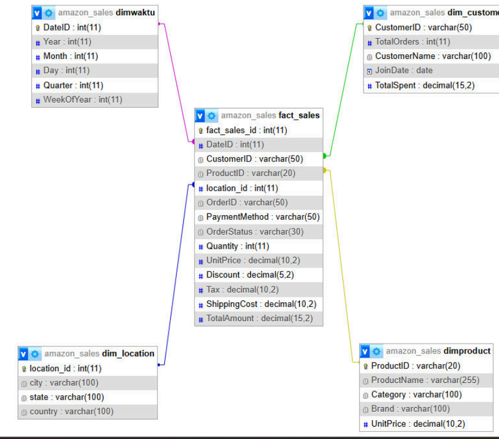
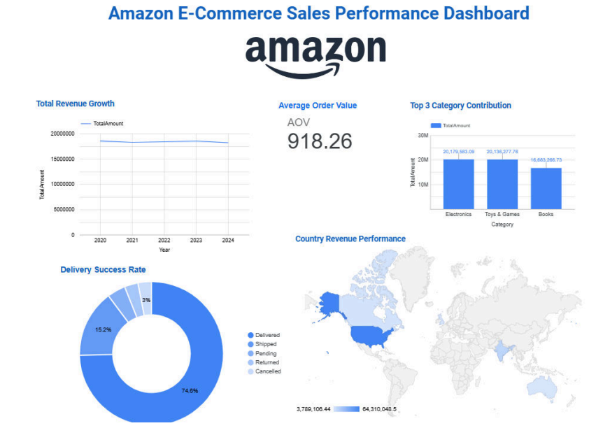

# 📊 Amazon E-Commerce Sales Analytics using Data Warehouse & Business Intelligence

A Business Intelligence and Data Warehouse project focused on analyzing Amazon e-commerce sales performance using ETL, Star Schema modeling, KPI analysis, Data Mining, and interactive dashboards.

---

## 📌 Project Overview

The rapid growth of e-commerce platforms has generated massive volumes of transactional data that require structured processing and analysis to support business decision-making.

This project aims to design and implement a complete Business Intelligence pipeline for Amazon e-commerce sales analysis by combining:

- Data Warehouse implementation
- ETL processes
- KPI monitoring
- Data Mining techniques
- Interactive dashboard visualization

The project was developed as part of the Data Warehouse & Business Intelligence course at Telkom University.

---

## 🎯 Project Objectives

- Design a structured Data Warehouse architecture for Amazon sales data
- Implement ETL processes for centralized analytical storage
- Analyze business performance using KPI metrics
- Apply data mining techniques to identify trends and business insights
- Develop an interactive dashboard for decision support

---

## 📂 Dataset Information

| Information | Details |
|---|---|
| Dataset | Amazon Sales Dataset |
| Source | Kaggle |
| Format | CSV |
| Total Records | 100,000 transactions |
| Total Columns | 20 columns |

### Dataset Features

| Category | Attributes |
|---|---|
| Customer | CustomerID, CustomerName |
| Product | ProductID, ProductName, Category, Brand |
| Sales | Quantity, UnitPrice, Discount, TotalAmount |
| Transaction | OrderID, PaymentMethod, OrderStatus |
| Location | City, State, Country |
| Time | OrderDate |

---

## 🏗️ Data Warehouse Architecture

The project uses a **Star Schema** approach consisting of:

- **Fact Table**
  - `fact_sales`

- **Dimension Tables**
  - `dimproduct`
  - `dim_customer`
  - `dim_location`
  - `dimwaktu`

### ⭐ Star Schema Design

  

The star schema was designed to support efficient analytical queries and KPI reporting by integrating transactional sales data with multiple business dimensions.

---

## 🔄 ETL Process

The ETL (Extract, Transform, Load) pipeline was implemented using **Pentaho Data Integration (PDI)**.

### ETL Stages

#### 1️⃣ Extract
- Import raw Amazon transaction dataset
- Retrieve sales, customer, product, and location data

#### 2️⃣ Transform
- Data cleaning
- Duplicate handling
- Attribute selection
- Data aggregation
- Dimension mapping
- Key generation

#### 3️⃣ Load
- Load transformed data into Data Warehouse tables
- Populate fact and dimension tables

---

## ⚙️ Technologies Used

| Technology | Purpose |
|---|---|
| Python | Data analysis & preprocessing |
| MySQL | Data Warehouse storage |
| Pentaho PDI | ETL implementation |
| Looker Studio | Dashboard visualization |
| Scikit-learn | Data mining & modeling |
| Pandas | Data manipulation |
| Google Colab | Development environment |

---

## 📈 Key Performance Indicators (KPI)

The project evaluates Amazon business performance using five main KPIs.

| KPI | Target |
|---|---|
| Total Revenue Growth | ≥ 8% YoY |
| Average Order Value (AOV) | Analyze transaction value |
| Delivery Success Rate | ≥ 90% Delivered |
| Top Category Contribution | Top 3 categories ≥ 50% revenue |
| Country Revenue Performance | Top 5 countries ≥ $500K |

---

## 🤖 Data Mining Implementation

Several machine learning and analytical techniques were applied:

### 1️⃣ Linear Regression
Used to analyze yearly revenue growth trends.

### 2️⃣ Logistic Regression Classification
Used to predict delivery success rates based on order status.

### 3️⃣ KPI Performance Analysis
Used to evaluate whether business targets were achieved.

---

## 📊 KPI Analysis Results

| KPI | Result | Status |
|---|---|---|
| Revenue Growth | Fluctuating growth trend | ❌ Not Achieved |
| Average Order Value | $918.25 | ✅ Achieved |
| Delivery Success Rate | 74.6% | ❌ Not Achieved |
| Top Category Contribution | 50.30% | ✅ Achieved |
| Country Revenue Performance | Top 5 countries > $500K | ✅ Achieved |

---

## 🖥️ KPI Dashboard

The interactive dashboard was developed using **Looker Studio** and connected directly to the MySQL Data Warehouse.

### Dashboard Features

- Revenue trend analysis
- Delivery performance monitoring
- Top-selling category visualization
- Country revenue distribution
- KPI achievement monitoring

### 📊 Dashboard Preview

  

The dashboard provides interactive business insights for monitoring financial performance, operational effectiveness, and sales contribution across multiple product categories and regions.

---

## 📌 Business Insights

### Key Findings

- Revenue growth remains unstable across multiple years
- Delivery success rate is below operational targets
- Electronics, Sports & Outdoors, and Books contribute the highest revenue
- International market performance remains strong

### Recommendations

- Improve logistics and delivery management
- Optimize high-performing product categories
- Expand marketing strategies for growth regions
- Enhance customer retention strategies

---

## 🚀 Future Improvements

Potential future enhancements include:

- Real-time dashboard integration
- Advanced forecasting models
- Recommendation system implementation
- Supply chain optimization analytics
- Predictive customer behavior analysis

---

## 🔗 Dashboard Access

Dashboard Link:  
[Dashboard KPI](https://lookerstudio.google.com/reporting/721353f3-cc20-47fb-a82c-bd2222b8c4e6)

---
Report Link:
[Report DWBI](https://drive.google.com/file/d/1ZyunOgDUl6S6zIrUe4w7u17ItZZJmRri/view?usp=sharing)

---
Google Colab Link:
[IPYNB](https://colab.research.google.com/drive/1BnpBEOiNXYFpB1ufc1q6WAlRQag_Ezjn)